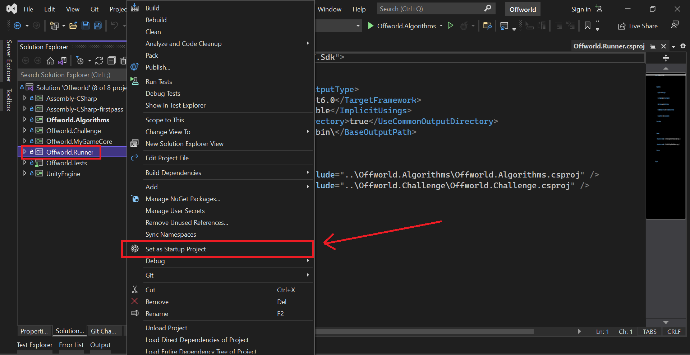
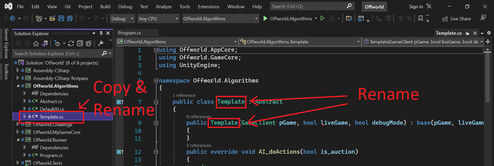
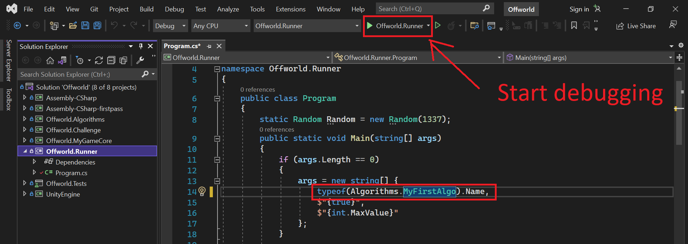

# The Innovation Game - Offworld Challenge

## Objective
**Offworld Trading Company** is a computer game of economic warfare taking place on Mars. 

The challenge is to develop an AI to buyout the opponent AI's corporation within 7 Martian days.

## Repo Structure

* `Offworld.Algorithms` contains all the uploaded algorithms for this challenge. Any algorithm you develop should go in here
* `Offworld.Challenge` contains the logic for running & verifying algorithms for this challenge
* `Offworld.MyGameCore` contains boilerplate code to bridge the challenge logic with Offworld Trading Company's game logic
* `Offworld.Runner` contains an executable program for debugging / running your algorithms during development
* `Offworld.Tests` contains tests for the challenge logic 
* `Assembly-CSharp` is a stub of Offworld Trading Company's non-game logic library.
* `Assembly-CSharp-firstpass` is a modified version of Offworld Trading Company's game logic library.
* `UnityEngine` is a stub of UnityEngine for Offworld Trading Company.

## Getting Started

1. [Install Visual Studio 2022](https://visualstudio.microsoft.com/vs/)

2. Fork and clone this repo

3. Create a branch for your algorithm
```
git checkout -b <team name>/algorithm/<algorithm name>
```

3. Open `Offworld.sln` with Visual Studio 2022

4. Set `Offworld.Runner` as your startup project



5. Make a copy of `Offworld.Algorithms\Template.cs` and rename filename & class to your algorithm name



6. Modify `Offworld.Runner\Program.cs` to use your algorithm and start developing / debugging!



7. During the allowed window, push up your branch and open a pull request to merge your branch to the master repository 

## Debugging your Offworld AI

It is highly recommended to have a [Steam copy of the game](https://store.steampowered.com/app/271240/Offworld_Trading_Company/) for debugging purposes
   * Note: an Epic games copy will not support mods and versions

See [Offworld-Mods Repo](https://github.com/the-innovation-game/offworld-mods) for instructions on how to debug your AI in-game.


## Support
[Join our Discord](http://discord.the-innovation-game.com)
